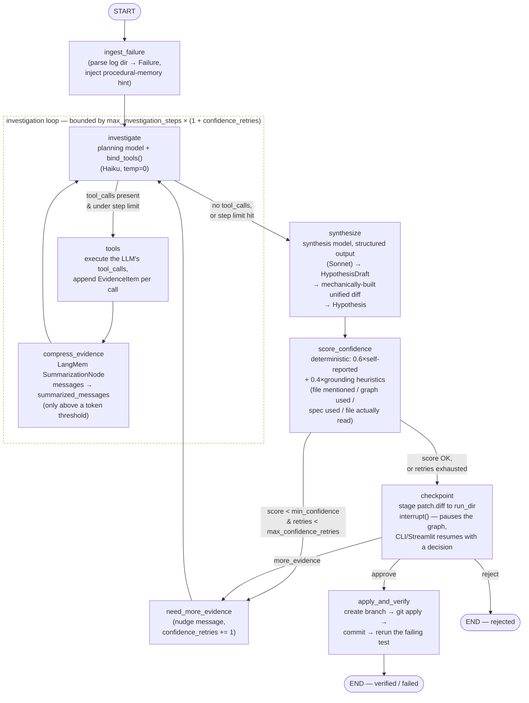
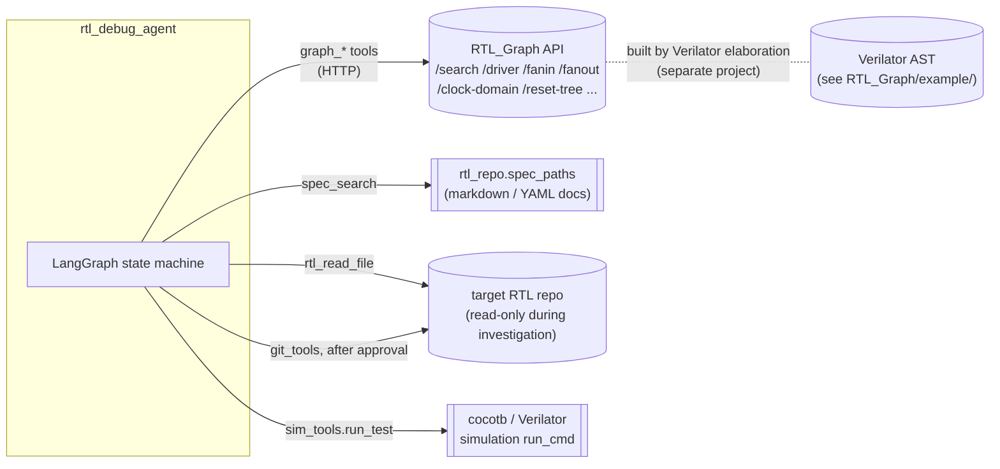

# Agent Architecture

This is a LangGraph state machine, not a single agentic loop: one node plans
and calls tools, a separate (stronger) model synthesizes the final diagnosis,
a deterministic scorer gates it, and a human approves before anything ever
touches the RTL repo's git history. Everything below is drawn directly from
`agent/graph.py`, `agent/state.py`, `agent/nodes/*.py`, and `agent/tools/*.py`
— not a simplification of them.

## 1. State machine

**Why two models.** `investigate` runs on the cheap `models.planning` model
(`claude-haiku-4-5`, `temperature=0`) because tool-argument selection is a
routine, high-frequency decision where precision on exact signal/module names
matters more than creativity. Only `synthesize` — the one-shot, structured-
output diagnosis — escalates to `models.synthesis` (`claude-sonnet-5`).

**Why the loop can re-enter itself twice.** There are two independent ways
back into `investigate`: the tool-call loop itself (`tools → compress_evidence
→ investigate`), and `score_confidence` bouncing a synthesized-but-unconvincing
hypothesis back via `need_more_evidence`. The latter also resets the step
budget — see `_effective_limit` in `agent/nodes/investigate.py` — so a
low-confidence hypothesis doesn't just get stuck against an already-exhausted
step count.

**Where the human sits.** `checkpoint` is the only interrupt point.
`langgraph.types.interrupt()` genuinely suspends execution — the CLI's
`debug` subcommand runs up to here and exits; a later, separate `approve` /
`reject` / `more-evidence` invocation resumes the *exact same* persisted run
(`SqliteSaver`, keyed by `run_id` as the LangGraph thread id) from a different
process. `apply_and_verify` is the only node that touches the RTL repo's
working tree or git state, and it only runs after `approve`.

## 2. Tools available to the model

Only `investigate`'s bound model can call tools — `tools` is a dumb dispatcher
over this fixed list, built once in `agent/graph.py`:

| Tool | Source | What it queries |
|---|---|---|
| `graph_search` | `graph_tools.py` | free-text search over the RTLGraph node index |
| `graph_trace_driver` | `graph_tools.py` | what logic drives a signal (`/driver`) |
| `graph_trace_receivers` | `graph_tools.py` | what reads a signal (`/receivers`) |
| `graph_fanin` | `graph_tools.py` | transitive upstream dependency closure |
| `graph_fanout` | `graph_tools.py` | transitive downstream dependency closure |
| `graph_dependency_path` | `graph_tools.py` | shortest dependency path between two signals |
| `graph_clock_domain` | `graph_tools.py` | which clock a signal is sequenced on |
| `graph_reset_tree` | `graph_tools.py` | which reset (+ co-reset registers) a signal belongs to |
| `graph_module_hierarchy` | `graph_tools.py` | instance tree under a module |
| `spec_search` | `spec_tools.py` | keyword/section search over `rtl_repo.spec_paths` only — scoped so `docs/verification/bug_list.md` is unreachable even though it lives in the same tree |
| `rtl_read_file` | `rtl_tools.py` | verbatim source read, the only path that can produce grounded `old_lines` for a patch |

All nine `graph_*` tools are a thin `GraphDBClient` wrapper around the
sibling **RTL_Graph** project's REST API (`config.graph_db.api_url`, with a
`local_fallback_*` config for spinning up a local instance) — this agent has
no graph-building code of its own; RTLGraph is the sole source of structural
truth.

Two tool modules are deliberately **not** LLM-callable, and are only ever
invoked directly by nodes:

| Module | Used by | Why not exposed to the model |
|---|---|---|
| `git_tools.py` (branch/apply/commit) | `apply_and_verify` | only valid after human approval — never speculative |
| `sim_tools.py` (`run_test`) | `apply_and_verify` | a real simulation run costs tens of seconds; only makes sense once, to verify a committed fix, never as exploratory guessing |

`log_tools.py`'s `parse_failure` isn't a tool either — it's called directly
by `ingest_failure` to turn a raw simulation log directory into the
structured `Failure` the rest of the graph operates on.

## 3. State (`agent/state.py`)

`DebugState` is a single `TypedDict` threaded through every node — LangGraph
merges each node's returned dict into it. Layers worth knowing about:

- **Conversation:** `messages` (full, `add_messages`-annotated, the permanent
  audit trail) vs. `summarized_messages` (LangMem's compressed view — what
  `investigate` actually re-sends once the transcript crosses a token
  threshold; `messages` itself is never truncated).
- **Investigation bookkeeping:** `evidence` (one `EvidenceItem` per tool
  call — tool name, args, a 500-char result summary), `investigation_steps`,
  `confidence_retries`.
- **Diagnosis artifacts:** `hypothesis` (`Hypothesis`, holding the
  mechanically-constructed `patch_diff`), `confidence` (`ConfidenceResult`
  with a `score`/`label`/`rationale`).
- **Control:** `phase` (`diagnosing → awaiting_approval → applying →
  verified|rejected|failed`) and `approval_decision`, set by `checkpoint`
  from whatever the resuming CLI/UI call passed to `interrupt()`.
- **Post-approval outcome:** `branch_name`, `rerun_passed`, `rerun_summary`.

## 4. Persistence & memory

Three independent SQLite-backed stores, all scoped under `run_dir` or
`data/`, none of which is the RTLGraph database itself:

- **`checkpoint.sqlite`** (`SqliteSaver`, per-run) — LangGraph's own
  checkpointer. Makes `interrupt()`/`Command(resume=...)` durable across
  process boundaries; this is what lets `debug` and a later `approve` be two
  separate CLI invocations.
- **`patch.diff`** (per-run, plain file) — staged by `checkpoint` before the
  interrupt fires, so a reviewer can read the exact diff on disk while the
  graph is paused.
- **`data/memory/store.sqlite`** (`SqliteStore`, cross-run) — procedural
  memory keyed by `(project, error_class)`, exact-match only (no embeddings
  configured). `ProceduralMemory.recall` injects a one-line hint — the tool
  sequence and file that resolved the same error class last time — into
  `ingest_failure`'s prompt; `.remember()` is only called after a run reaches
  `verified`.
- **`trail.jsonl`** (per-run, append-only) — structured "what the agent
  concluded" events, separate from the plain debug log, and what the
  dashboard (`dashboard/generate.py`) is built from.

## 5. External systems

The agent treats RTL_Graph strictly as an external service (REST, optionally
a local fallback process) — never as a library it links against. If
RTL_Graph's inference logic changes (e.g. how it assigns clock/reset
domains), that's a black-box behavior change from this agent's point of
view, only observable through what `graph_clock_domain` / `graph_reset_tree`
return.
